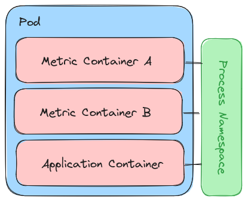
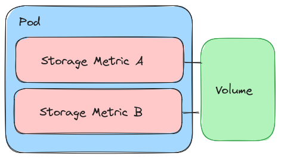

# Design Thinking

Our "MetricSet" is mirroring the design of a JobSet, which can combine multiple different things (i.e., metrics) into a cohesive unit. 

## Kubernetes Abstractions

We use a JobSet on the top level with Replica set to 1, and within that set, we create a ReplcatedJob that can hold one or more containers. The containers and design depend on the metric
of interest, for which we currently support application and storage (discussed below).

### Metrics

We provide support to measure the following types of metrics:

### Performance

For a performance metric, we create a separate container for each metric (these are pre-built and provided alongside the operator) and then add the application container to the set. This means that the set of metrics containers and application containers serve as sidecars in the same pod:

In the above, the metrics pods have `SYS_PTRACE` added and a flag is set to share the process
namespace, so we can read and write to the application container from a metrics pod. We should
be able to see things in the opposite direction, but without permissions. I've tested this
setup with more than one metric container, and it seems to work. You can read more about some of this [early testing here](https://vsoch.github.io/2023/shared-process-namespace/) and think this is a good idea, at least to start.  This means, generally for a "perf" metric design, we deploy
it alongside an application of interest, wait to see the PID of the running process, and then
monitor it at some frequency (rate) for some number of times (completions) or until the application is done running, whichever is first. Current metric output is in the pod logs, and hopefully we can improve upon this. In addition to performance, it would be nice to have a simple means to measure the timing of the application.

### Storage

Setting up storage, typically by way of a persistent volume claim that turns into a persistent volume, is complex. This means that we require that the user (likely you) creates the PVC on your own, and then you can provide information about it to the operator. The operator will then request a volume, measure something on it for some rate and length of time, and then clean up.
That looks like this:

### Others

There are likely others (and I need to think about it)

## Database for Metric Storage

I want to try creating a consistent database that can be used to store metrics across runs. In the space of an operator,
this means we can't clean it up when the specific metric is deleted, but rather it should be owned by the namespace.
I'm not sure how to do that but will think about ideas. Worst case, we have the user deploy the database in the same namespace
separately. Best case, we can manage it for them, or (better) not require it at all.
I don't want anything complicated (I don't want to re-create prometheus or a monitoring service!)

