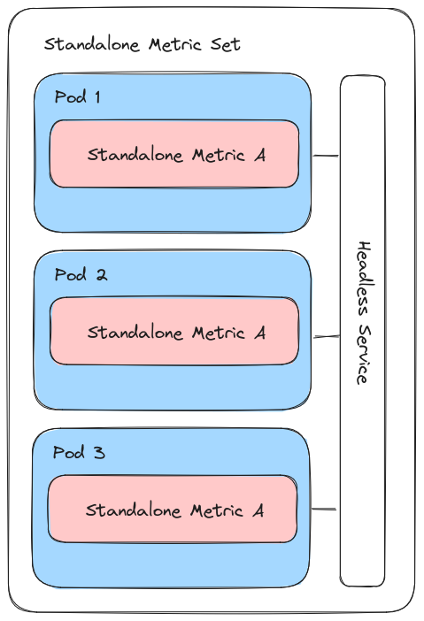

# Design Thinking

Our "MetricSet" is mirroring the design of a JobSet, which can combine multiple different things (i.e., metrics) into a cohesive unit. 
With this design, we assume that you are primarily interested in measuring an application performance, collecting storage metrics, or 
"rolling your own" design with a custom metric (e.g., a networking metric that has a special setup with a launcher and other customizations to the JobSet)

## Overview

Given the above assumption, the logic flow of the operator works as follows:

 - The user writes a metrics.yaml file that optionally includes an application OR storage description or neither for a custom metric. Typically, you'd provide an application for performance metrics, and storage for IO/filesystem metrics, and neither for a custom metric.  
 - Each metric in the list is also associated with a type (internal to the operator) that is checked. This means if you define an `Application`
 - The operator will create a JobSet that runs one or more metrics per MetricSet type:
   - Application metrics create a JobSet with each metric as a sidecar container sharing the process namespace to monitor (they can be given volumes if needed)
   - Storage metrics deploy the metrics as containers and give them access to the volume
   - Standalone metrics can do any custom design needed, and do not require application or storage (but can be provided storage volumes)

The current design allows only one JobSet per metrics.yaml, but this can be relaxed to allow up to three JobSets per metrics.yaml (one for each of the types specified above).
We will write this into more detail in the usage docs.

## Kubernetes Abstractions

We use a JobSet on the top level with Replica set to 1, and within that set, for each metric type we create one or more ReplcatedJob that can hold one or more containers. The containers and design depend on the metric of interest, for which we currently support application (performance), storage, and standalone metrics (discussed below).

### Metrics

For our initial design, we allowed metrics of different types to be combined (e.g., running an application performance metric
alongside a storage one within the same JobSet) but for our second design we decided to enforce separation of concerns.
More specifically, if you are benchmarking storage, you are unlikely to also be benchmarking an application, and vice
versa. The design of the operator was updates to reflect this preference. Thus, the three groups of metrics we believe
are most strongly assessed together are:

- **performance**: measuring an application performance through time via a shared process namespace
- **storage**: measuring storage read/write or general IO for one or more mounted volumes
- **standalone** a more complex metric that might require custom JobSet logic, and is intended to be run in isolation.

### Performance

For a performance metric, we create a separate container for each metric (these are pre-built and provided alongside the operator) and then add the application container to the set. This means that the set of metrics containers and application containers serve as sidecars in the same pod:

In the above, the metrics pods have `SYS_PTRACE` added and a flag is set to share the process
namespace, so we can read and write to the application container from a metrics pod. We should
be able to see things in the opposite direction, but without permissions. I've tested this
setup with more than one metric container, and it seems to work. You can read more about some of this [early testing here](https://vsoch.github.io/2023/shared-process-namespace/) and think this is a good idea, at least to start.  This means, generally for a "perf" metric design, we deploy
it alongside an application of interest, wait to see the PID of the running process, and then
monitor it at some frequency (rate) for some number of times (completions) or until the application is done running, whichever is first. Current metric output is in the pod logs, and hopefully we can improve upon this. In addition to performance, it would be nice to have a simple means to measure the timing of the application.

### Storage

Setting up storage, typically by way of a persistent volume claim that turns into a persistent volume, is complex. This means that we require that the user (likely you) creates the PVC on your own, and then you can provide information about it to the operator. The operator will then request a volume, measure something on it for some rate and length of time, and then clean up.
That looks like this:

### Standalone

A standalone metric does not require an application container or a storage specification, but rather uses a "standalone" setting that indicates it runs on its own. This is also enforced in design - since a standalone metric has finer control of the underlying JobSet, as a metric
it must be run on its own. As an example, for a networking tool that uses MPI to run across nodes, we can set the number of pods (via the indexed job) to a number greater than 1, and then we will be making an indexed job with that many pods to run the command.  That might look like this:

We don't technically need a shared process space, a storage setup, or an application. 
And actually, that headless service that provides the network is available for storage
or applications as well - we just don't use them in the previous example! The ability
to scale (via a number of pods > 1) is also a feature of storage and services if your
tool requires that.

## Database for Metric Storage

I want to try creating a consistent database that can be used to store metrics across runs. In the space of an operator, this means we can't clean it up when the specific metric is deleted, but rather it should be owned by the namespace. I'm not sure how to do that but will think about ideas. Worst case, we have the user deploy the database in the same namespace
separately. Best case, we can manage it for them, or (better) not require it at all.
I don't want anything complicated (I don't want to re-create prometheus or a monitoring service!)

## Design Links

 - Original diagrams (August 2023) are available on [Excalidraw](https://excalidraw.com/#json=ldENW1vScvb123alpXeHm,Q8k9VqoRGQSPrP23CztV5Q)