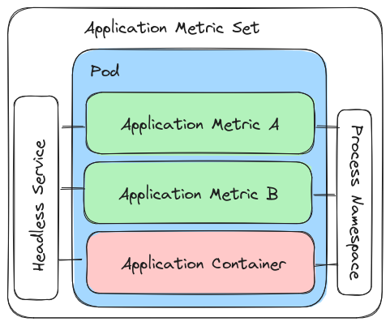
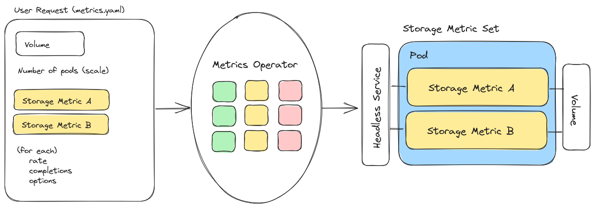
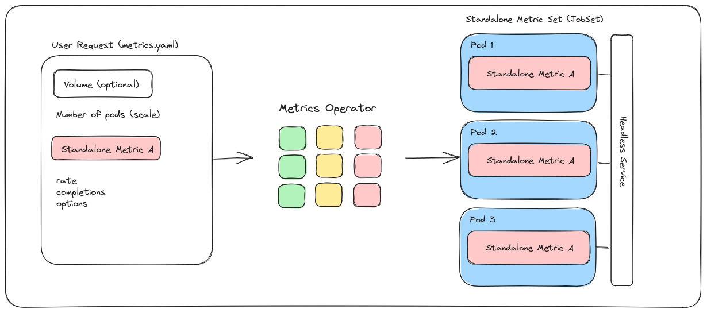
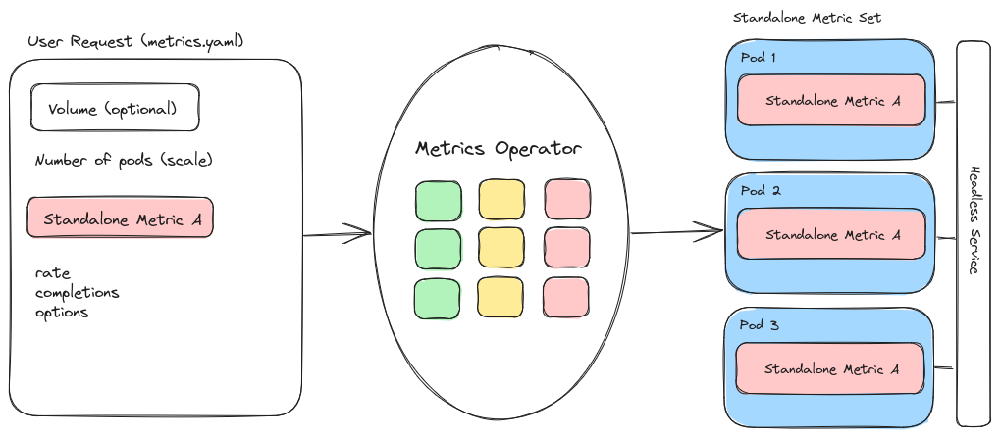

# User Guide

Welcome to the Metrics Operator user guide! If you come here, we are assuming you have a cluster
with the Metrics Operator installed and are interested to submit your own [custom resource](custom-resource-definition.md) to create a MetricSet, or that someone has already done it for you. If you are a developer wanting to work on new functionality or features, see our [Developer Guides](../development/index.md) instead.

## Usage

### Overview

Our "MetricSet" is mirroring the design of a [JobSet](https://github.com/kubernetes-sigs/jobset/), which can combine multiple different things (i.e., metrics) into a cohesive unit.
When you create a MetricSet using this operator, we assume that you are primarily interested in measuring an application performance, collecting storage metrics, or
using a custom metric provided by the operator that has less stringent requirements.

<details>

<summary>Logic Flow of Metrics Operator</summary>

Given the above assumption, the logic flow of the operator works as follows:

1. You write a metrics.yaml file that optionally includes an application OR storage description or neither for a custom metric. Typically, you'd provide an application for performance metrics, and storage for IO/filesystem metrics, and neither for a custom metric. In simpler terms, we have three types of MetricSet - Application Metric Sets, Storage Metric Sets, and Standalone Metric Sets.
2. You also include a list of metrics. Each metric you choose is associated with a type (internal to the operator) that can match to an Application, Storage, or Standalone Metric set. Don't worry, this is checked for you, and you can use our **TBA** metrics registry to find metrics of interest.
3. The operator will create a JobSet for your metrics set. The structure of this JobSet depends on the type (see more below under [metrics](#metrics)). Generally:
 - Application metrics create a JobSet with each metric as a sidecar container sharing the process namespace to monitor (they can be given volumes if needed)
 - Storage metrics deploy the metrics as containers and give them access to the volume
 - Standalone metrics can do any custom design needed, and do not require application or storage (but can be provided storage volumes)

</details>

Generally, you'll be defining an application container with one or more metrics to assess performance, or a storage solution with the same, but metrics to assess IO. There are several modes of operation, depending on your choice of metrics.

### Install

#### Quick Install

This works best for production Kubernetes clusters, and comes down to first installing JobSet (not yet part of Kubernetes)

```bash
kind create cluster
VERSION=v0.2.0
kubectl apply --server-side -f https://github.com/kubernetes-sigs/jobset/releases/download/$VERSION/manifests.yaml
```

and then downloading the latest Metrics Operator yaml config, and applying it.

```bash
kubectl apply -f https://raw.githubusercontent.com/converged-computing/metrics-operator/main/examples/dist/metrics-operator.yaml
```

Note that from the repository, this config is generated with:

```bash
$ make build-config
```

and then saved to the main branch where you retrieve it from.

#### Helm Install

We optionally provide an install with helm, which you can do either from the charts in the repository:

```bash
$ git clone https://github.com/converged-computing/metrics-operator
$ cd metrics-operator
$ helm install ./chart
```

Or directly from GitHub packages (an OCI registry):

```
# helm prior to v3.8.0
$ export HELM_EXPERIMENTAL_OCI=1
$ helm pull oci://ghcr.io/converged-computing/metrics-operator-helm/chart
```
```console
Pulled: ghcr.io/converged-computing/metrics-operator-helm/chart:0.1.0
```

And install!

```bash
$ helm install chart-0.1.0.tgz
```
```console
NAME: metrics-operator
LAST DEPLOYED: Fri Mar 24 18:36:18 2023
NAMESPACE: default
STATUS: deployed
REVISION: 1
TEST SUITE: None
```

### Getting Started

Let's first review how this works.

1. We provide metrics here to assess performance, storage, networking, and other custom cases (called standalone).
2. You can choose one or more metrics to run alongside your application or storage (volumes) and measure.
3. The metric output is printed in pod logs with a standard packaging (e.g., sections and headers) to distinguish output sections.
4. We provide a Python module [metricsoperator](https://pypi.org/project/metricsoperator/) that can help you run an experiment, applying the metrics.yaml and then retrieving and parsing logs.

For the last step, this is important because every metric tool is a special snowflake, outputting some custom format that is hard to parse and then plot. By providing a parser paired with each metric, we hope to provide an easy means to do this so you can go from data collection to results more quickly. Now let's review a suggested set of steps for you as a new user! You can:

1. First choose one or more [metrics](metrics.md), [request a metric be added](https://github.com/converged-computing/metrics-operator/issues), or start with a pre-created [examples](https://github.com/converged-computing/metrics-operator/tree/main/examples). Often if you want to measure an application or storage or "other" (e.g., networking) we already have a metrics.yaml and associated parser suited for your needs.
2. Run the metric directly from the metrics.yaml, or use the Python module [metricsoperator](https://pypi.org/project/metricsoperator/) to run and collect output.
3. Plot the results, and you're done!

For step 2, you can always store output logs and then parse them later if desired.
For a quick start, you can likely explore our [examples](https://github.com/converged-computing/metrics-operator/tree/main/examples) directory,
which has both examples we use in [testing](https://github.com/converged-computing/metrics-operator/tree/main/examples/tests) along with full
[Python examples](https://github.com/converged-computing/metrics-operator/tree/main/examples/python) that will use the associated metrics.yaml files, but also submit and parse the output.
Once you are comfortable with the basics, you can browse our [available metrics](metrics.md) and either design your
own, or [request a metric be added](https://github.com/converged-computing/metrics-operator/issues). Our goals are to
make these easy to deploy with minimal complexity for you, so we are happy to help. We also encourage you to share examples
and experiments that you put together here for others to use.

## Metrics

For all metric types, the following applies:

1. You can create more than one pod (scale the metric) as you see fit.
2. There is always a headless service provided for metrics within the JobSet to make use of.
3. The definition of metrics in your metrics.yaml file is consistent across types.
4. Each metric type in the list can take a rate, completions, and custom options.

For another overview of these designs, please see the [developer docs](../development/index.md).

### Application Metric Set

> An application metric set includes one or more metrics for measuring application performance.

Let's walk through an example. In the image below, you want to run one or more custom metrics to measure performance for your application of choice.


You'll do this by writing a metrics.yaml file (left panel) that defines the application of interest, which in this case in LAMMPS.
This will be handed to the metrics operator (middle panel) that will validate your MetricSet and prepare to deploy, and
the result is a JobSet (right panel) that includes a Job with one or more containers alongside your application.
Let's look at this process in more detail. Here is what the metrics.yaml file might look like.
Note that the image above defines two metrics, but the YAML file below only shows a list of one.

```yaml
apiVersion: flux-framework.org/v1alpha1
kind: MetricSet
metadata:
  labels:
    app.kubernetes.io/name: metricset
    app.kubernetes.io/instance: metricset-sample
  name: metricset-sample
spec:
  application:
    image: ghcr.io/rse-ops/vanilla-lammps:tag-latest
    command: mpirun lmp -v x 1 -v y 1 -v z 1 -in in.reaxc.hns -nocite
  metrics:
    - name: perf-sysstat
```

It was a design choice that using an application container in this context requires no changes to the container itself.
You simply need to know what the entrypoint command is, and this will allow the metric sidecar containers to monitor it.
In our case, for our command we are issuing `mpirun`, and that's what we want to monitor. Thus, the `image` and `command` attributes are the
only two required for a basic application setup. For the next section, "metrics" we've found an application metric (so it can be used for an
Application Metric Set) that we like called `perf-sysstat`, and we add it to the list. We could easily have added more, because one
application run can be monitored by several tools, but we will keep it simple for this example. Next, let's submit this to the metrics operator.

```bash
$ kubectl apply -f metrics.yaml
```

When the operator receives the custom resource, it will do some obvious validation, like did you provide application metrics for an application?
Did you provide all the required fields? Did you only provide a definition for one metric type? Any errors will result in not creating the MetricSet,
and an error in the operator logs. Given that you've provided a valid custom resource YAML and one or more application metrics
that the operator knows, it will then select your metrics from the set it has internally defined (middle panel). This panel shows that
the operator knows about several application (green), storage (yellow), and standalone (red) metrics, and it's going
to combine them into a JobSet that includes your application container to allow each metric to assess performance.



Focusing on the third panel, the way this works is that we create a JobSet with a single replicated job with multiple containers.
One container is for your application, and the others are sidecar containers that are running the metrics. Again, because of this design
you don't need to customize or tweak your application container! By way of the shared process namespace and knowing the command you've
executed, the sidecar containers can easily "peek in" to your application container to monitor the process and save metrics.
For this application metric set design, all containers should complete to determine success of the JobSet, and we currently
rely on pod logs to get output, however we hope to have a more solid solution for this in the future.

### Storage Metric

> A storage metric set includes one or more metrics for assessing one or more volumes

If you are interested in measuring the goodness of different kinds of volumes, you might be interested in creating a storage metric set! The design is similar
to an application metrics set, however instead of an application of interest, you provide one or more storage volumes of interest. Here is a small
example that assumes a host volume:

```yaml
apiVersion: flux-framework.org/v1alpha1
kind: MetricSet
metadata:
  labels:
    app.kubernetes.io/name: metricset
    app.kubernetes.io/instance: metricset-sample
  name: metricset-sample
spec:
  storage:
    volume:
      # This is the path on the host (e.g., inside kind container)
      hostPath: /tmp/workflow

      # This is the path in the container
      path: /workflow

  metrics:
    - name: io-sysstat
      rate: 10
      completions: 2
```

In the above, we want to use the storage metric called "io-sysstat" to assess a host volume at `/tmp/workflow` that is mounted to `/workflow` in the container. Since a volume
could last forever (hypothetically) we ask for two completions 10 seconds apart each. This means we will get data for two timepoints from the metric, and after that,
the assessment will be complete. We can also look at this visually:


In the above, we are providing storage metrics (the image has two despite the yaml above showing one) that the operator knows about, along with a storage volume that we want to test.
The operator will prepare a JobSet with one replicated job and several containers, where one container is created per storage metric, and the volume bound to each.



In simple terms, a storage metric set will use the volume of interest that you request, and run the tool there.
Read/write is important here - e.g., if the metric needs to write to the volume, a read only volume won't work. Setting up storage
is complex, so it's typically up for you to create the PVC and then the operator will create the volume for it. Keep in mind that you should
honor RWX (read write many) vs just RW (read write) depending on the design you choose. Also note that by default, we only create one pod,
but if appropriate you can scale up to more.

### Standalone Metric

> A custom, standalone metric that doesn't abide by any rules!

The standalone metric is the most interesting of the set, as it doesn't have a strict requirement for a storage or application definition.
We currently have a few flavors of standalone metrics that include:

 - applications that are timed (e.g., LAMMPS)
 - networking tools (e.g., OSU benchmarks and netmark)

By definition, it is "standalone" because it's going to create a custom JobSet setup for a metric of interest. Because we cannot be
certain of how to combine different jobs within this JobSet, we currently only allow one standalone metric to be defined at once.
This means that in the diagram below, you see online one standalone metric in the metrics.yaml



As an example, we can look at a standalone metric to run a tool called netmark.

```yaml
apiVersion: flux-framework.org/v1alpha1
kind: MetricSet
metadata:
  labels:
    app.kubernetes.io/name: metricset
    app.kubernetes.io/instance: metricset-sample
  name: metricset-sample
spec:
  # Number of indexed jobs to run netmark on
  pods: 4
  metrics:
   - name: network-netmark

     # Custom options for netmark
     # see pkg/metrics/network/netmark.go
     options:
       tasks: 4
```

This is a standalone metric because it creates a JobSet with not one replicated job, but two! There is a launcher container
to issue an `mpirun` command, and one or more worker containers that interact via MPI. This is a simple example, but any design
for a JobSet could work here, and hence why the metric is standalone. However, it's neat that the interface presented to you
is consistent - it's simply a matter of asking for the metric that is known to the operator to be a standalone.
The image below also demonstrates that this standalone metric (along with storage or application) can be scaled to more
than one pod, if appropriate.



For more detail about this design, see the [developer docs](../development/index.md).

## Containers Available

All containers are provided under [ghcr.io/converged-computing/metrics-operator](https://github.com/converged-computing/metrics-operator/pkgs/container/metrics-operator). The latest tag is the current main branch, a "bleeding edge" version, and we will provide releases when the operator is more stable.
