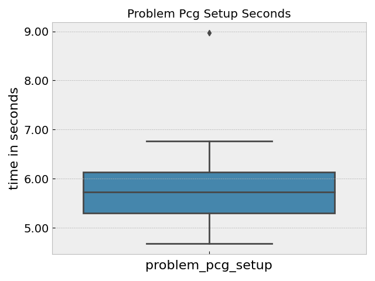
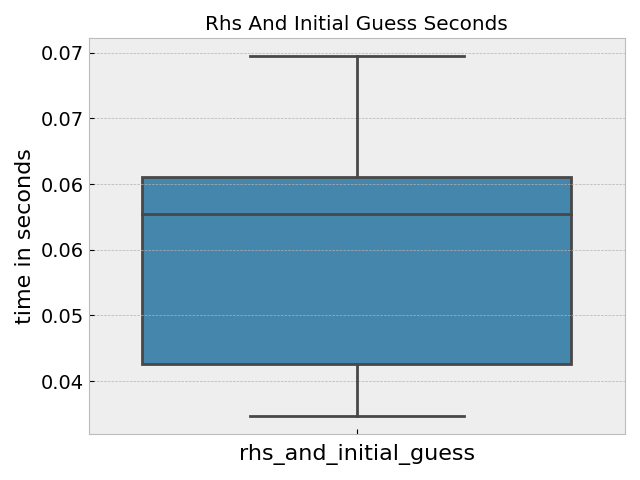
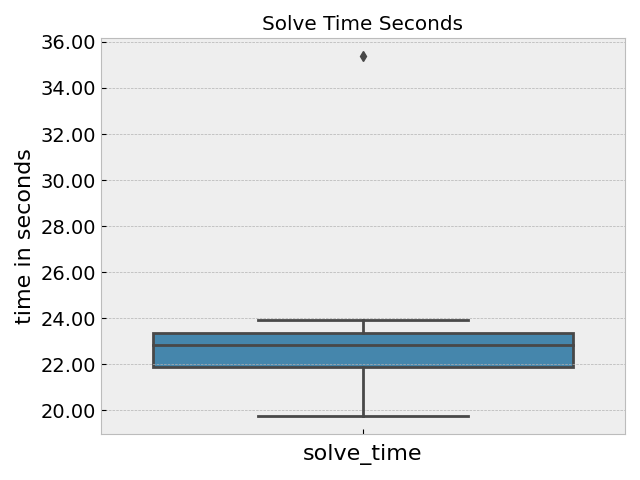

# AMG Python

This is a quick example to show running and plotting AMG!
The plotting and parsing is a derivative from the [canopie-22](https://github.com/flux-framework/flux-k8s/blob/canopie22-artifacts/canopie22-artifacts/amg/process_amg.py) 
experiments written by Dan Milroy (thank you)! This assumes you have a running cluster with JobSet and the Metrics Operator installed,

```bash
$ python run-metric.py
```

The script will use the metricsoperator library to submit the [metrics.yaml](../../tests/app-amg/metrics.yaml)
and then wait for the pod to complete and parse the output in the log.

## Example Plots

Here is a result plot, data from a small set of 10 iterations!
I am not totally sure, but these are all the "wall time seconds" that I found in the data.




