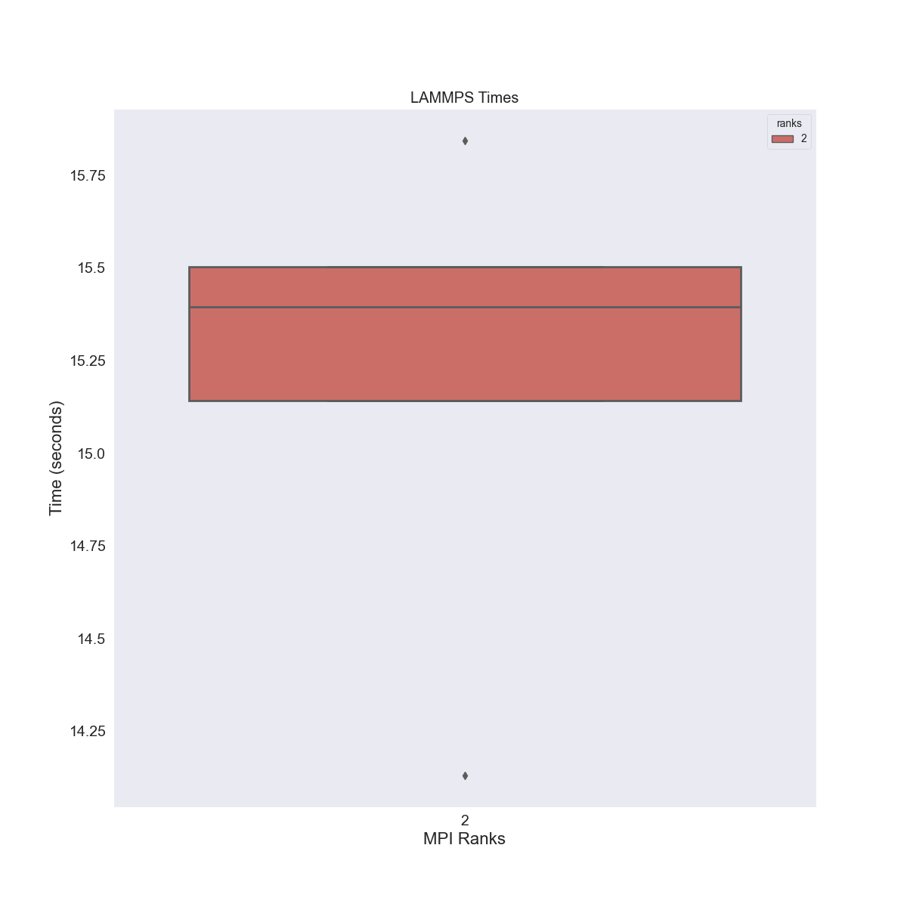

# LAMMPS Python

This is a quick example to show running and plotting LAMMPS!
This assumes you have a running cluster with JobSet and the Metrics Operator installed,

```bash
$ python run-metric.py
```

The script will use the metricsoperator library to submit the [metrics.yaml](../../tests/app-lammps/metrics.yaml)
and then wait for the pod to complete and parse the output in the log.

## Example Plots

Here is a small example - 5 run with 2 pods!


