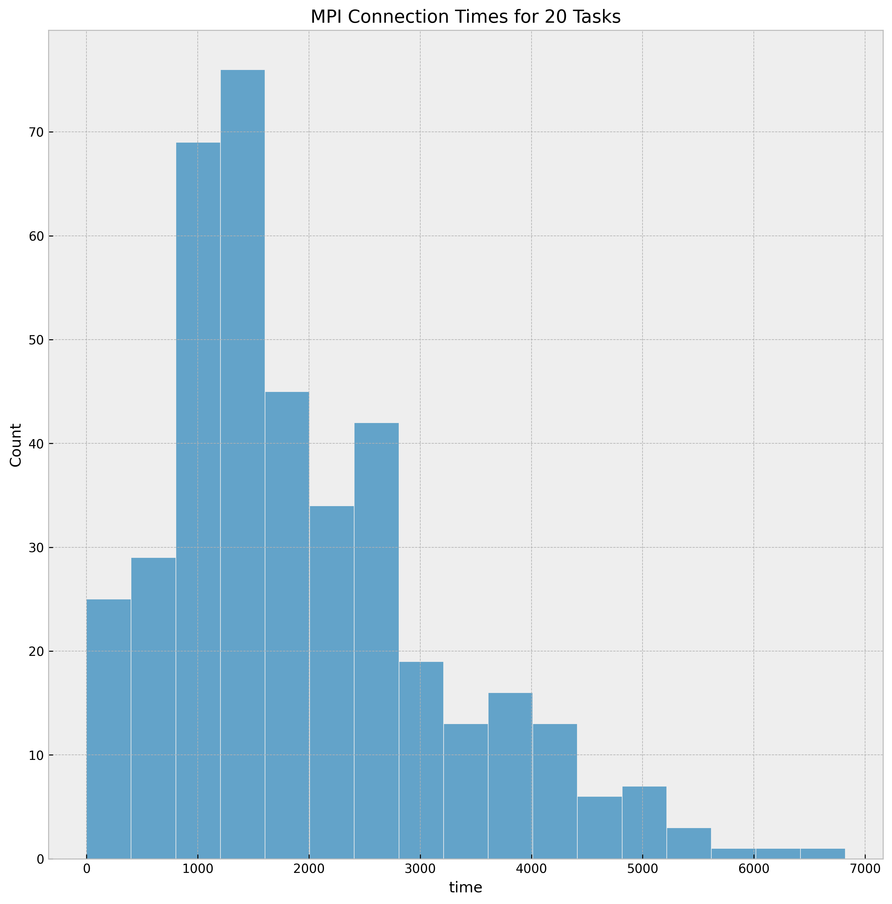

# Netmark Python

This is a quick example to show running and plotting Netmark benchmarks!
These were run on my local machine so the times are terrible.
This assumes you have a running cluster with JobSet and the Metrics Operator installed,
and you have a local build of `vanessa/netmark` that you've loaded into your cluster
(as the software is private).

```bash
$ python run-metric.py
```

The script will use the metricsoperator library to submit the [metrics.yaml](metrics.yaml)
and then wait for the pod to complete and parse the output in the log.

## Example Plots


