# OSU Benchmarks Python

This is a quick example to show running and plotting a few of the benchmarks!
This assumes you have a running cluster with JobSet and the Metrics Operator installed!

```bash
$ python run-metric.py
```

The script will use the metricsoperator library to submit the associated yaml under [tests](../../tests)
and then wait for the pod to complete and parse the output in the log. You can also run the example
to do multiple runs of each OSU benchmark:

```bash
$ python run-metric-multiple.py --iter 5
```

## Example Plots

### Single Run

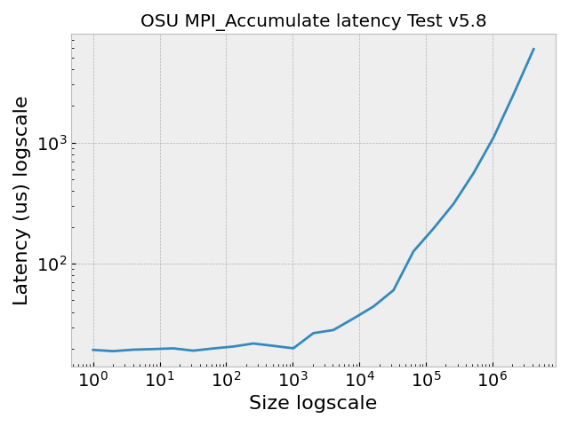
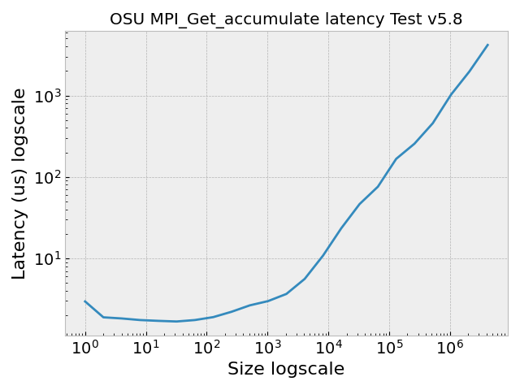
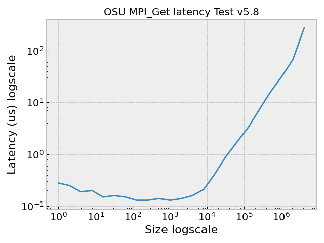
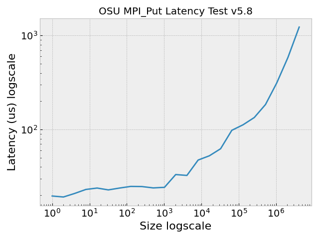

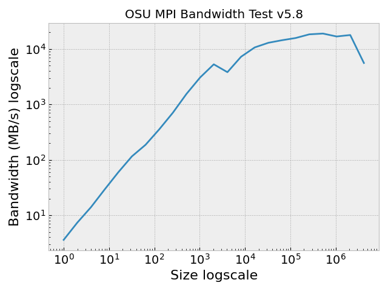
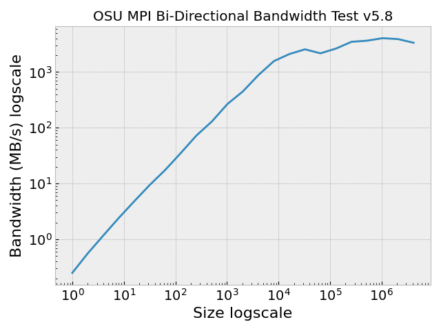
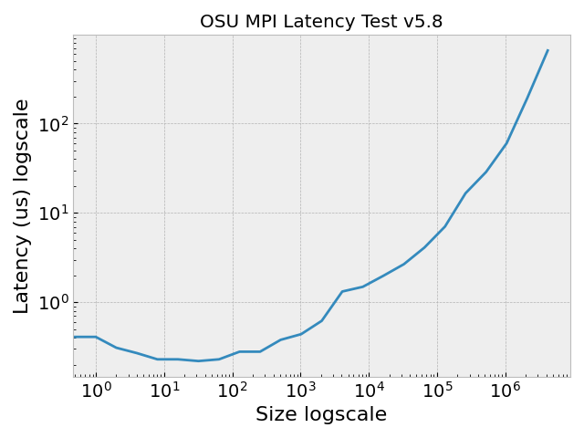

### Multiple Run

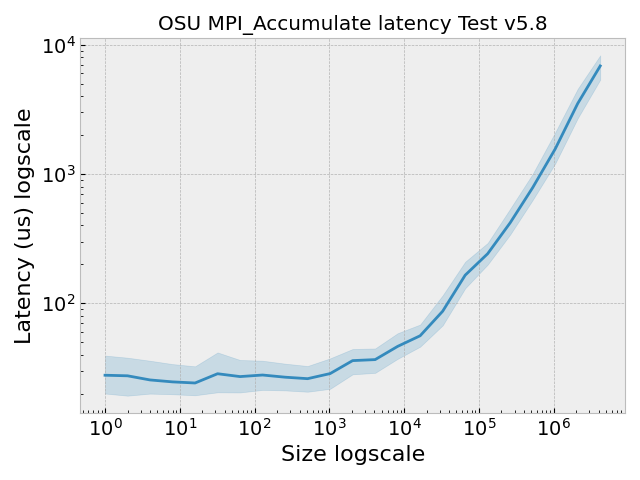
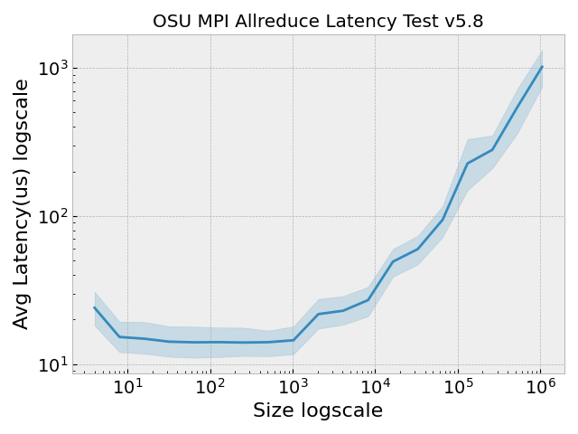
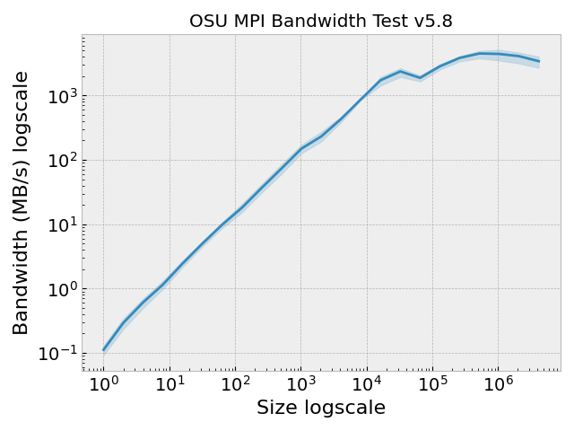

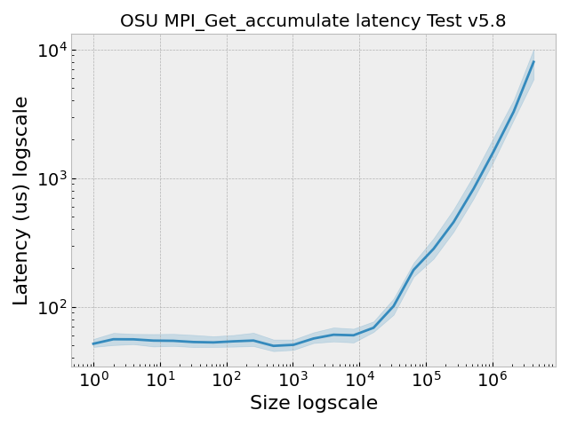
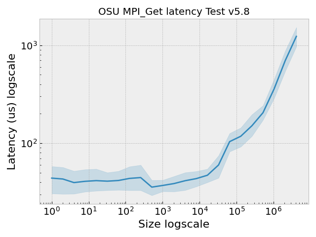
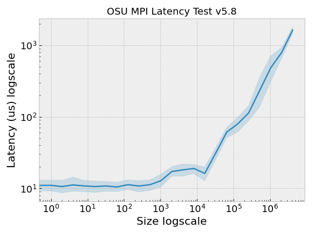
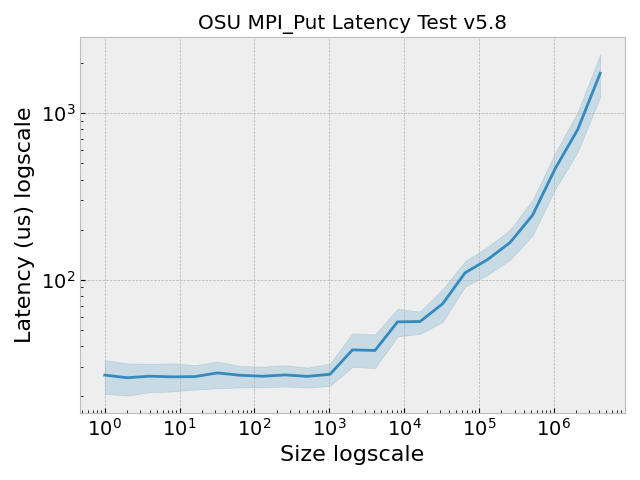


Note that if you add the option `timed: true` this will add extra 'wrapper' times around the above,
and an extra data output for it in your results.