# Performance Sysstat (pidstat) Python

This is a quick example to show running and plotting pidstat metrics!
This is done with a small LAMMPS run so we at least have a few timepoints.
This assumes you have a running cluster with JobSet and the Metrics Operator installed,

```bash
$ python run-metric.py
```

The script will use the metricsoperator library to submit the [metrics.yaml](metrics.yaml)
and then wait for the pod to complete and parse the output in the log.

## Example Plots

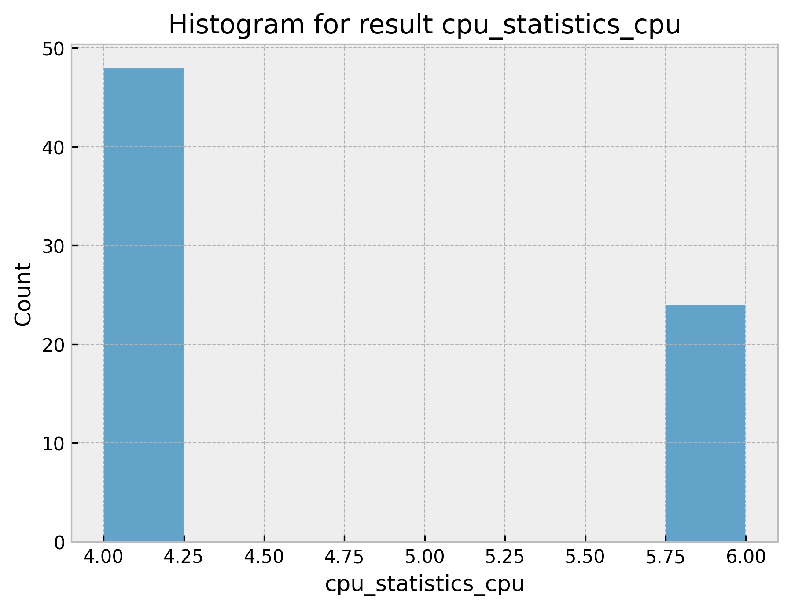
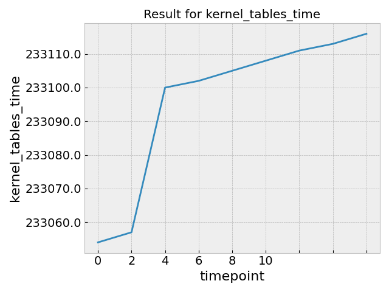

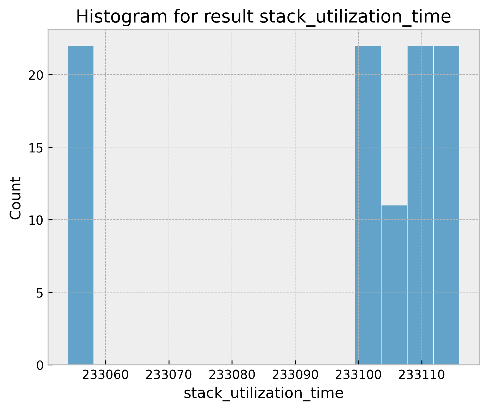

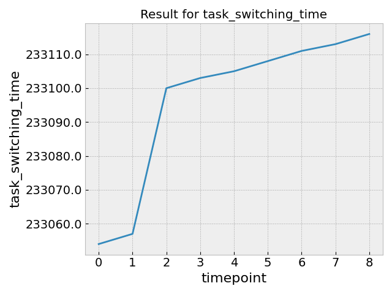
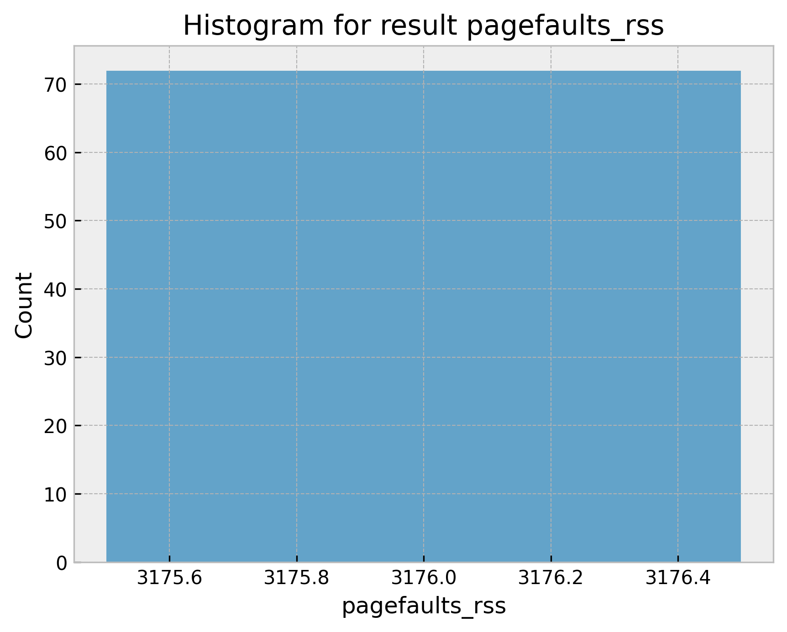

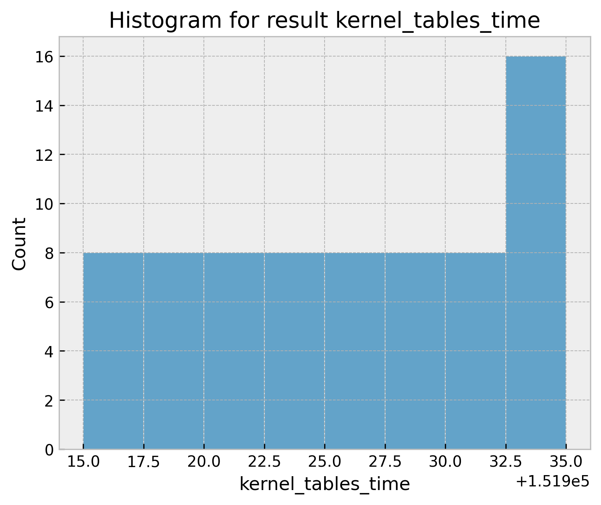
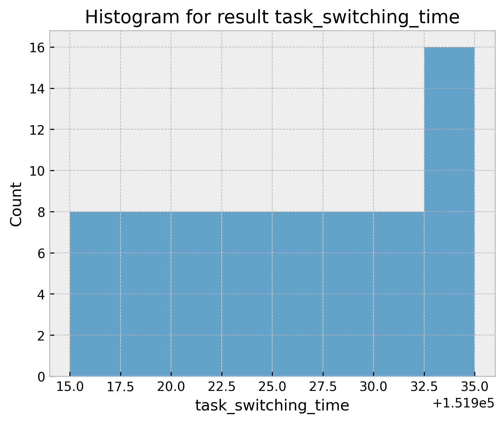

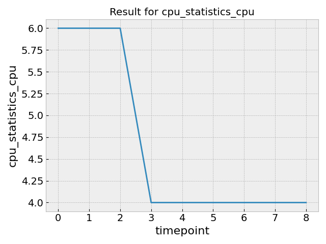
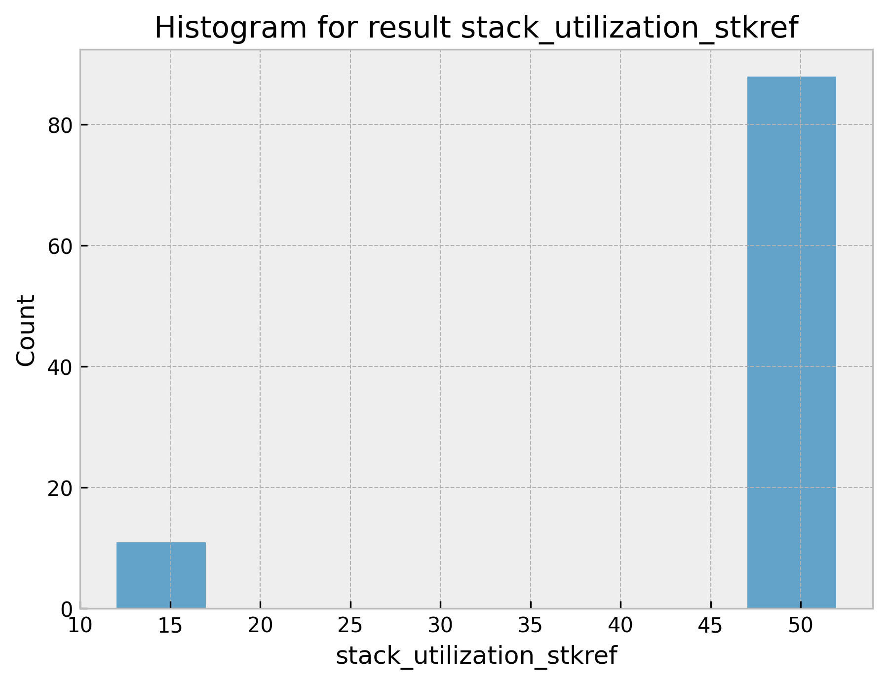
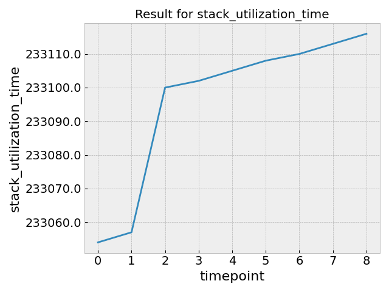

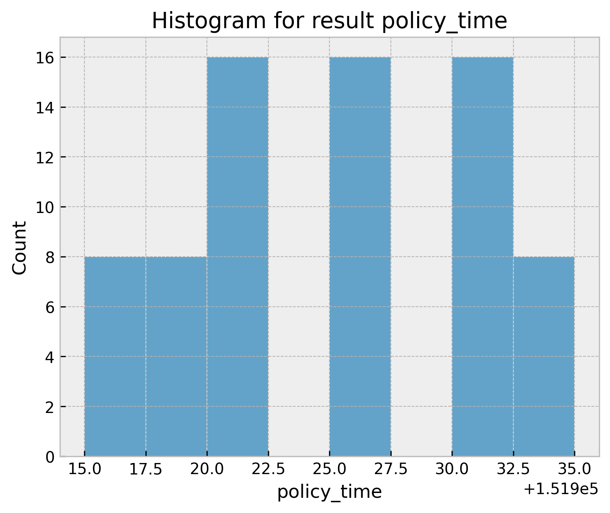

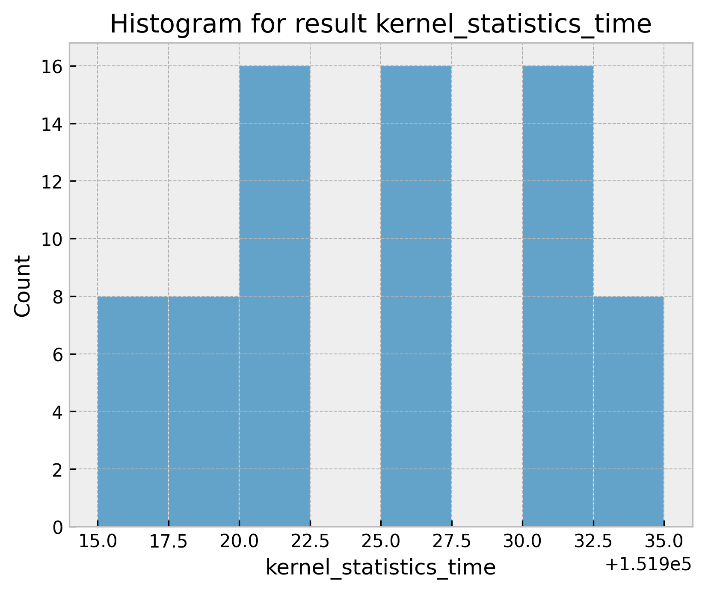


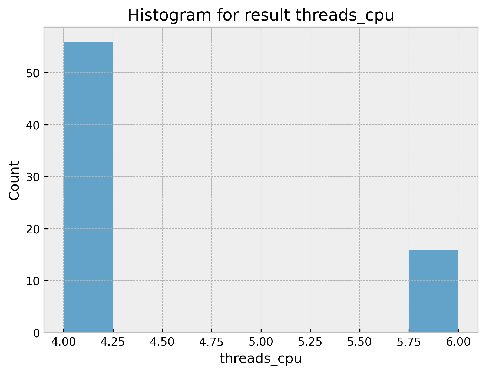


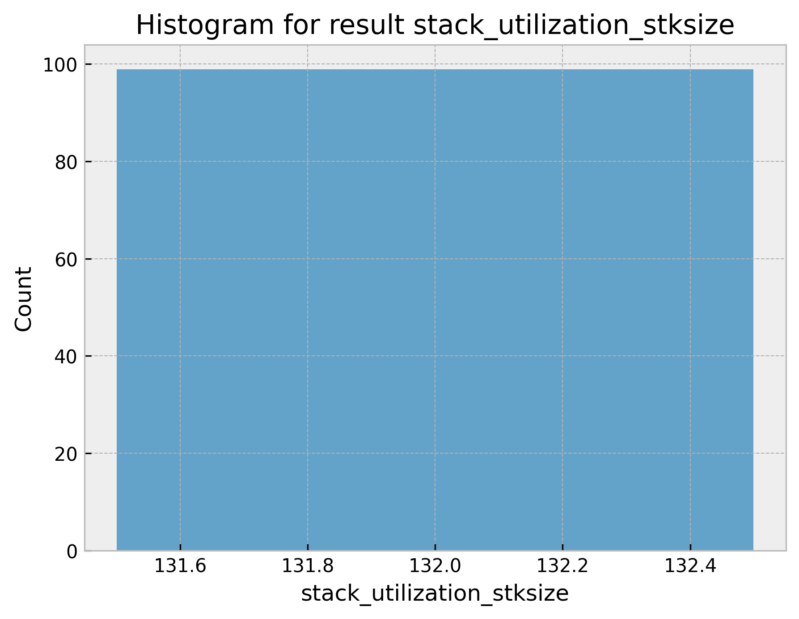
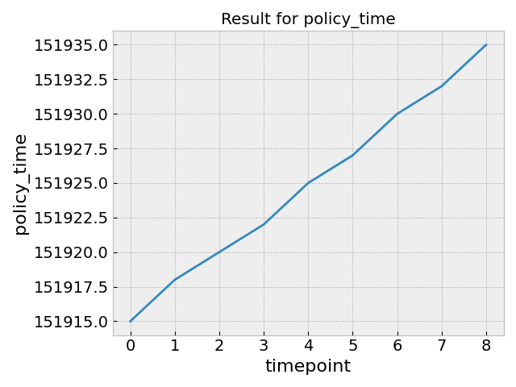
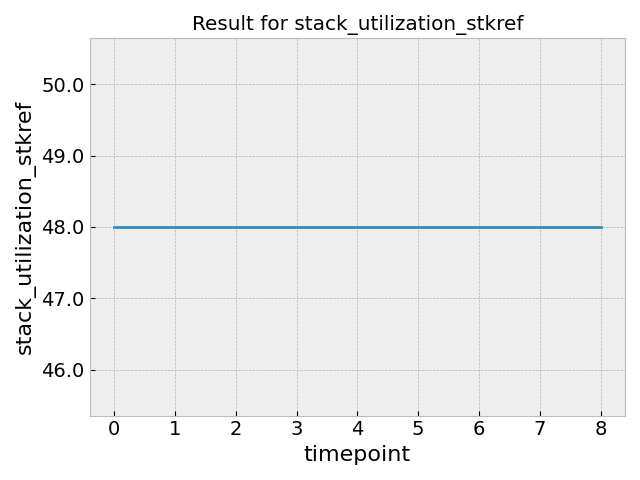
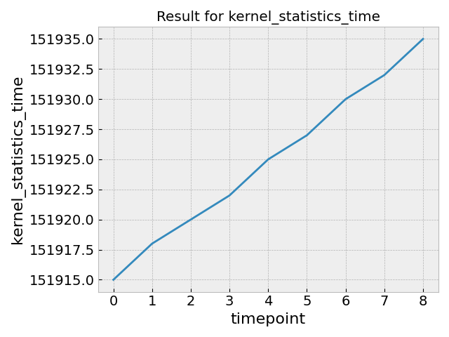
