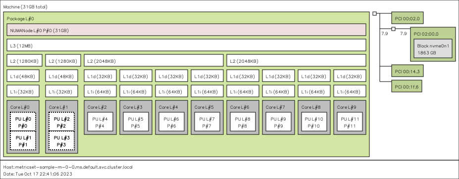

# Hwloc Example

Let's run an interactive metric with hwloc.

## Usage

Create a cluster and install JobSet to it.

```bash
kind create cluster
VERSION=v0.2.0
kubectl apply --server-side -f https://github.com/kubernetes-sigs/jobset/releases/download/$VERSION/manifests.yaml
```

Install the operator (from the development manifest here):

```bash
$ kubectl apply -f ../../dist/metrics-operator-dev.yaml
```

How to see metrics operator logs:

```bash
$ kubectl logs -n metrics-system metrics-controller-manager-859c66464c-7rpbw
```

Then create the metrics set. This is going to run lstopo and save the image application.png in the container root!
Note that you can customize the command as an option "command" (e.g., to run something else).

```bash
kubectl apply -f metrics.yaml
```

Wait until you see pods created by the job and then running (there should be one with two containers, one for the app lammps and the other for the stats):

```bash
kubectl get pods
```
```diff
NAME                           READY   STATUS              RESTARTS   AGE
- metricset-sample-m-0-0-mkwrh   0/1     ContainerCreating   0          2m20s
+ metricset-sample-m-0-0-mkwrh   1/1     Running             0          3m10s
```

This container doesn't have interesting logs unless your command generates output. For the default, we generate "application.png" and can
save it here:

```bash
$ kubectl  cp metricset-sample-m-0-0-9h7b7:/architecture.png architecture.png
```
And there it is!



When you are done, cleanup!

```bash
kubectl delete -f metrics.yaml
```
